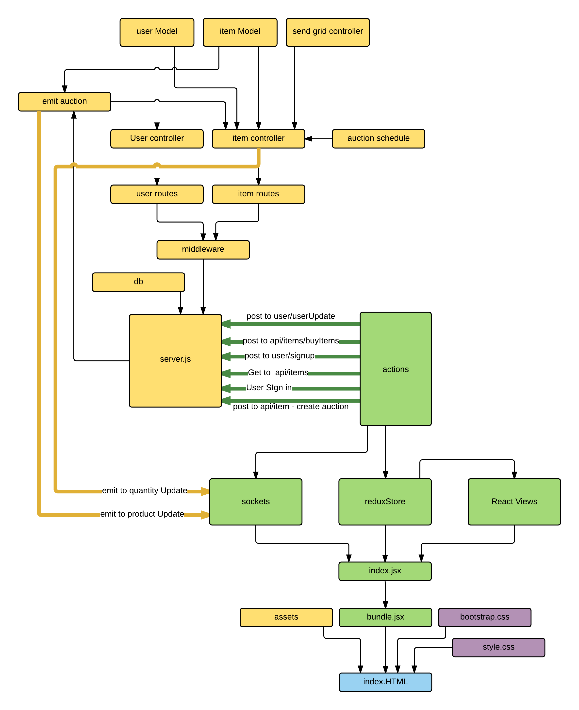

# Chutte.com #
Chutte.com is a reverse auction style web application. Our aim is to create a marketplace optimized for sellers to move product, and buyers to aquire those products at prices that appeal to them. We understand that pricing can make or break a product, our **Chutte pricing algorithm** removes the stressful burden of having to get pricing perfect. The price algorithm changes over the course of an items' listing, decreasing when there is no demand and holding when demand exists at a price point.  
---

Table of Contents
-----------------
1. [Demo](#demo)
2. [Getting Started](#getting-started)
3. [Usage](#usage)
4. [Structure](#structure)
5. [Tech Stack](#tech-stack)
6. [Webpack](#webpack)
7. [Troubleshooting](#troubleshooting)
8. [Contributing](#contributing)

Demo
----

Check out [chutte.com](http://www.chutte.com/). 
Also check out [our quick demo video](http://bit.ly/chutte).


Getting Started
---------------

Clone the repo and install the necessary node modules:

```shell
$ git clone https://github.com/KGB-JS/chutte.git
$ cd chutte
$ npm install                   # Install Node modules listed in ./package.json (this will be a while)
```

Usage
-----

#### `npm run build`
Runs the webpack build system

#### `node server/server.js`
(by default found at `localhost:3000`).


Structure
---------

```

   |-client
   |---public
   |-----dist
   |---src                   # Application source code
   |-----actions             # Redux action creators
   |-----Components          # Generic React Components
   |-----containers          # Components that provide context
   |-----core-layout         # Components that dictate major page structure
   |-----reducers            # Redux reducers
   |-----socket
   |-----store               # Redux store configuration
   |-server
   |---config
   |---items
   |-----itemHelpers
   |---priceSchedule
   |---socket
   |---user
   |-test                    
```


Tech Stack
----------
*[Reverse Auction](https://en.wikipedia.org/wiki/Reverse_auction)
Some technologies we used:
  * [React](https://facebook.github.io/react/) for unidirectional data flow and performant UI
  * [Redux](https://github.com/rackt/redux) architecture for predictable app state, with [react-redux](https://github.com/rackt/react-redux) bindings
  * [react-router](https://github.com/rackt/react-router) and [redux-router](https://github.com/rackt/redux-router) for routing
  * [redux-devtools](https://github.com/gaearon/redux-devtools) for time travel debugging
  * [Babel](https://babeljs.io/) to transpile ES6/7 syntax
  * [Webpack](https://webpack.github.io/) for builds/automation, with [eslint](http://eslint.org/) linting and [mocha](https://mochajs.org/)/[chai](http://chaijs.com/) testing
  * [MongoDB](https://www.mongodb.org/) database with [Sequelize](http://docs.sequelizejs.com/en/latest/) ORM
  * [bcrypt](https://www.npmjs.com/package/bcrypt-nodejs) for user authentication
  * [Node](https://nodejs.org/en/)/[Express](http://expressjs.com/en/index.html) server with [redux-thunk](https://github.com/gaearon/redux-thunk) middleware


Using Redux DevTools
--------------------

In development, Redux Devtools are enabled by default. You can toggle visibility and move the dock around using the following keyboard shortcuts:

- <kbd>Ctrl+H</kbd> Toggle DevTools Dock
- <kbd>Ctrl+Q</kbd> Move Dock Position
- see [redux-devtools-dock-monitor](https://github.com/gaearon/redux-devtools-dock-monitor) for more detail information.

Webpack
-------

The webpack compiler configuration is located in `~/build/webpack`. Here you'll find configurations for each environment; `development`, `production`, and `development_hot`. These configurations are selected based on your current `NODE_ENV`, with the exception of `development_hot` which will _always_ be used by webpack dev server.

**Note**: There has been a conscious decision to keep development-specific configuration (such as hot-reloading) out of `.babelrc`. By doing this, it's possible to create cleaner development builds (such as for teams that have a `dev` -> `stage` -> `production` workflow) that don't, for example, constantly poll for HMR updates.

So why not just disable HMR? Well, as a further explanation, enabling `react-transform-hmr` in `.babelrc` but building the project without HMR enabled (think of running tests with `NODE_ENV=development` but without a dev server) causes errors to be thrown, so this decision also alleviates that issue.

Troubleshooting
---------------

Having an issue? Please let us know! Report it and we'll get to it as soon as possible.


Contributing
------------

If you would like to submit a pull request, please make an effort to follow the guide in [CONTRIBUTING.md](CONTRIBUTING.md).


Thanks for checking this out.

– KGB-JS / chutte (Peter, Sean, Mick and Tim)
